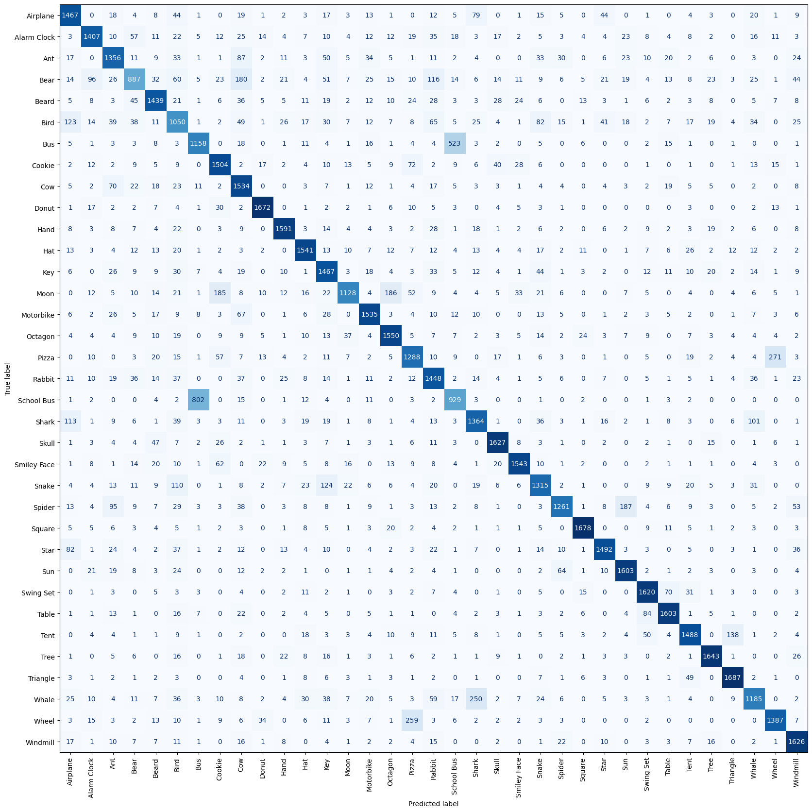

# Doodle Classification using CNN

This project focuses on developing a Convolutional Neural Network (CNN) model for classifying hand-drawn doodles into 35 different categories. The model is trained using a subset of [Google's Quick, Draw!](https://quickdraw.withgoogle.com/data) dataset and aims to recognize user-drawn sketches with high accuracy. The Project contains trained models, weights and an Interactive UI.


## Features
- Hand-drawn sketch recognition with real-time classification
- Preprocessing pipeline to normalize input data
- Custom-trained CNN model for efficient doodle classification
- Interactive UI with Dark Neon theme
- Confidence-based prediction results with a probability bar visualization

## Deployment
- The Model and GUI has been deployed in HuggingFace space.
- Access it from [here](https://huggingface.co/spaces/Rahul-Samedavar/DoodleClassifier)

## 🛠 Installation & Setup

### 1️⃣ **Clone the Repository**
```bash
git clone https://github.com/Rahul-Samedavar/DoodleMind.git
cd DoodleMind
```

### 2️⃣ **Create Virtual Environment(Optional)**
create virtual environment to avoi version conflicts.
```bash
python -m venv env
```
This creates a Virtual environment called env in the current directory. You need to activate this virtual environment to use the project.

windows users
```bash
env/Scripts/activate
```
Linux, Unix and Mac users
```bash
source env/bin/activate
```

### 3️⃣ **Install Dependencies**

to install the dependencies run:
```bash
pip install -r requirements.txt
```

### 4️⃣ **Run the Application**
```bash
python app.py
```
The application will be available at `http://localhost:5000`.


## Methodology of Training the Model
### **1. Dataset Preparation**
- The dataset consists of 35 doodle categories from Google's Quick, Draw!

  
- Subset containing 12000 doodles for each class was choosen too balance the dataset.
  
- Images were resized to **28x28 grayscale** format for model compatibility.
- Data was normalized to a **[0,1]** range to improve generalization.
- numpy.float16 data type was used for memory efficiency.
- Test split : 0.15


### **2. Model Architecture**
A CNN architecture was designed with the following layers:
```python
model = Sequential([
    Conv2D(16, (3,3), activation='relu', input_shape=(28, 28, 1)),
    MaxPooling2D(2,2),
    Conv2D(64, (3,3), activation='relu'),
    MaxPooling2D(2,2),
    Flatten(),
    Dropout(0.2),
    Dense(128, activation='relu'),
    Dropout(0.2),
    Dense(64, activation='relu'),
    Dropout(0.2),
    Dense(35, activation='softmax') 
])
```

```bash
Model: "sequential"
_________________________________________________________________
 Layer (type)                Output Shape              Param #   
=================================================================
 conv2d (Conv2D)             (None, 26, 26, 16)        160       
                                                                 
 max_pooling2d(MaxPooling2D) (None, 13, 13, 16)       0         
                                                                
                                                                 
 conv2d_1 (Conv2D)           (None, 11, 11, 64)        9280      
                                                                 
 max_pooling2d_1 (MaxPooling  (None, 5, 5, 64)         0         
 2D)                                                             
                                                                 
 flatten (Flatten)           (None, 1600)              0         
                                                                 
 dropout (Dropout)           (None, 1600)              0         
                                                                 
 dense (Dense)               (None, 128)               204928    
                                                                 
 dropout_1 (Dropout)         (None, 128)               0         
                                                                 
 dense_1 (Dense)             (None, 64)                8256      
                                                                 
 dropout_2 (Dropout)         (None, 64)                0         
                                                                 
 dense_2 (Dense)             (None, 35)                2275      
                                                                 
=================================================================
Total params: 224,899
Trainable params: 224,899
Non-trainable params: 0
_________________________________________________________________
```


### **3. Loss Function & Optimization**
- **Loss Function**: Categorical Crossentropy (since it's a multi-class classification problem)
- **Optimizer**: Adam (tuned for better convergence)
- **Learning Rate**: Tested over a range of values for initial learning rate and found sweet spot at 0.001
```python
model.compile(
    optimizer=Adamax(0.001),
    loss='categorical_crossentropy',
    metrics=['accuracy',  TopKCategoricalAccuracy(3), Precision(), Recall()]
)
```

### **4. Training Process**
- **Training Data Split**: 80% training, 20% validation, 
- **Batch Size**: 32 for memory efficiency
- **Epochs**: 50 epochs with saving model at each epoch through checkpoints.

    ```python
    from tensorflow.keras.callbacks import ModelCheckpoint

    checkpoint = ModelCheckpoint(
        filepath = "Models/model_epoch_{epoch:02}.keras",
        save_weights_only = False,
        save_best_only = False,
        monitor = 'val_loss',
        mode = 'min',
        verbose = 0
    )
    ```
- **Evaluation Metrics**: Accuracy, Top K Categorical Accuracy with k = 3, Precision, and Recall for model effectiveness


### **5. Testing and Model Selection**
- Models saved in each epoch are evluated using the test dataset.


- Model from epoch 50 showed the best accuracy of 86.29%.
- Model from epoch 44 showed the best Top K Categorical Accuracy of 95.31%.
- This scores are acceptable as they not only indicate good predictions, but also indicate the similarities between some classes. This can be understood from Confusion Matrix.



- As an example, we can see that the model predicted nearly half of the school busses as bus and 523 busses as school bus
- Although this reduces accuracy, it's a good sign considering both classes look nearly the same in doodles.

### **6. Deployment Considerations**
- Model and Weights exported in Keras and h5 format respectively.
- Integrated with a real-time drawing interface for inference
- Optimized preprocessing to match training data conditions (grid-based downscaling to 28x28 format)


---

